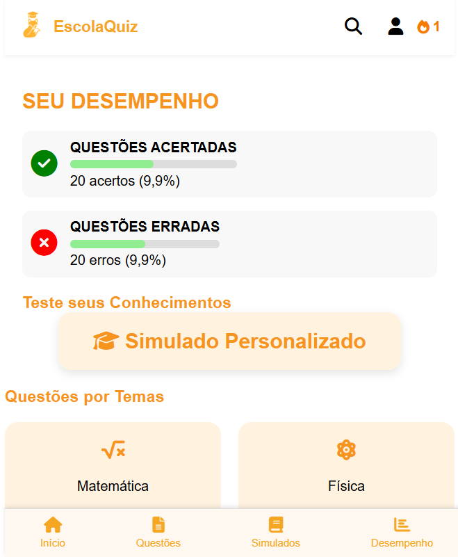
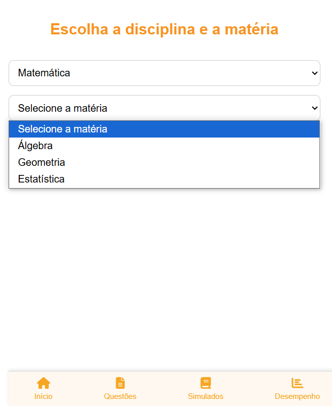
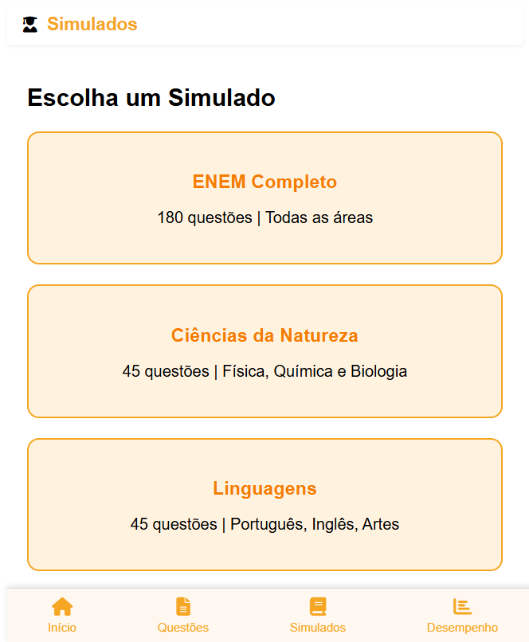
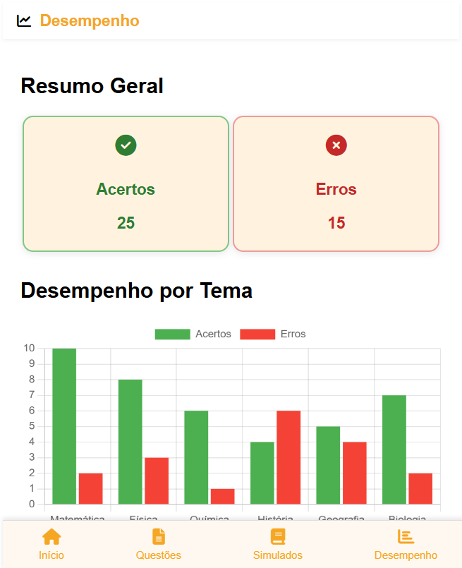

# ⋆｡‧˚ʚ🎓ɞ˚‧｡⋆ EscolaQuiz
O EscolaQuiz é uma plataforma de quizzes educacionais desenvolvida para ajudar estudantes a testarem seus conhecimentos e se prepararem para provas, como o ENEM. Através de simulados, questões por temas e acompanhamento de desempenho, o app oferece uma forma interativa e eficiente de estudar.

🚧 Este projeto ainda está em desenvolvimento e pode conter funcionalidades incompletas ou em fase de testes.

# ⋆˙⟡📸⋆˙⟡ Screenshots

# ⋆.˚✮🎧✮˚.⋆ Funcionalidades
- ✅ Simulados completos (ENEM e por área)

- 📚 Questões organizadas por disciplina e matéria

- 📊 Acompanhamento de desempenho geral e por tema

- 🔢 Estatísticas de acertos e erros

- 🎯 Simulados personalizados

- 🧠 Teste seus conhecimentos de forma interativa

# ‧₊ ᵎᵎ 🍒 ⋅ ˚✮ Tecnologias Utilizadas
- HTML

- CSS

- JavaScript

# ˚.🎀༘⋆ Como rodar o projeto
1- Clone o repositório:
git clone https://github.com/maryavila/escolaquiz.git

2- Acesse a pasta do projeto:
Abra o arquivo index.html no seu navegador.

# ⭒₊ ⊹📌 Status do Projeto
๋ ࣭ ⭑🚧 Projeto em desenvolvimento — melhorias futuras serão aplicadas como:

- Sistema de login e cadastro

- Banco de dados para salvar progresso dos usuários

- Geração de relatórios de desempenho

- Mais questões e conteúdos

- App mobile (Android e iOS)

